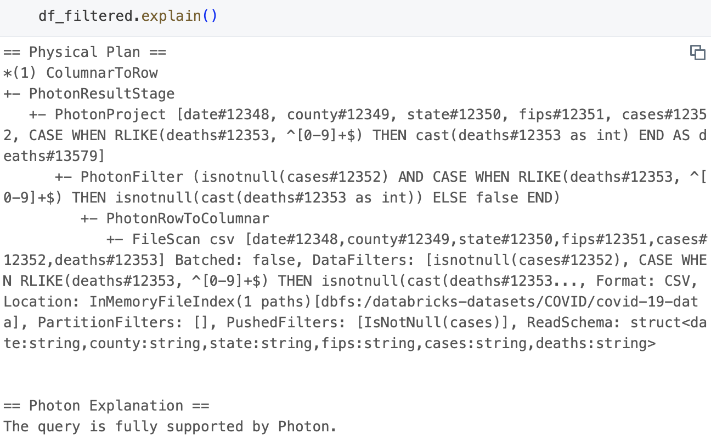
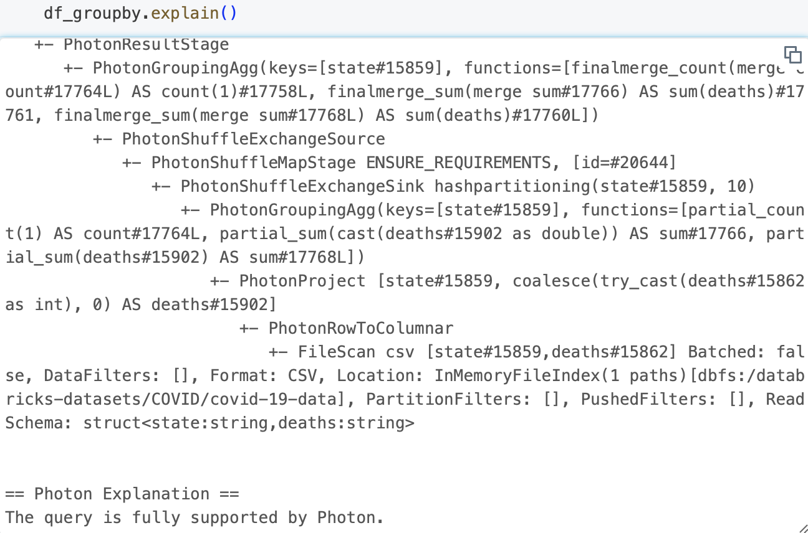
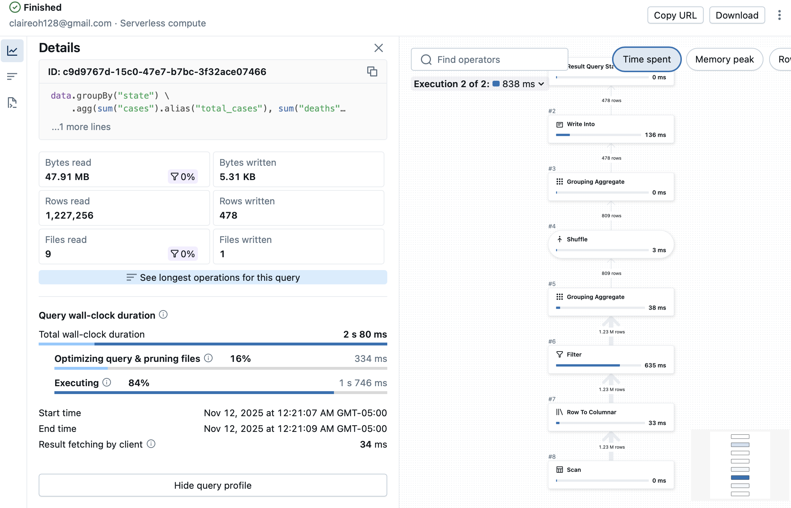
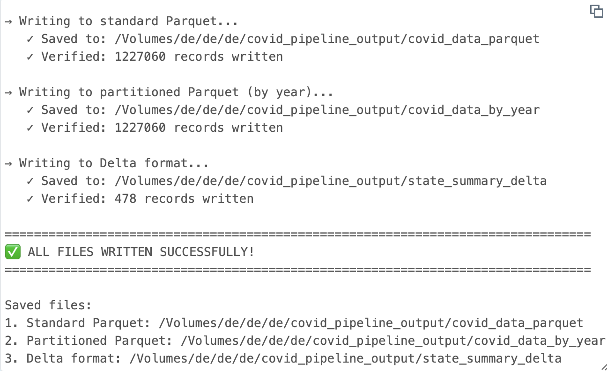

# 🚀 Databricks PySpark Demo

> COVID-19 Data Analysis Pipeline using Apache Spark

## 📊 Dataset Description

| Property | Details |
|----------|---------|
| **Source** | Databricks COVID-19 Public Dataset |
| **Format** | CSV files with daily COVID-19 counts |
| **Scope** | State and County level data |
| **Total Rows** | 1,227,256 |

**Schema:**
```
- date: Date of record
- county: County name
- state: State abbreviation
- cases: Number of COVID-19 cases
- deaths: Number of deaths
- fips: Federal Information Processing Standards code
```

---

## 🎯 Pipeline & Analysis Summary

This Spark pipeline demonstrates **comprehensive data engineering best practices**:

- ✅ Data cleaning and validation
- ✅ Early filtering for cost optimization
- ✅ Explicit type casting with error handling
- ✅ Efficient group-by aggregations
- ✅ Delta Lake format for ACID compliance

The pipeline handles malformed values gracefully (e.g., non-integer deaths → `NULL`) and applies filters early to minimize scan costs.

---

## 🔧 Core Pipeline Steps

### 1️⃣ Read & Inspect
- Load CSV data
- Display schema and row count
- Preview sample records

### 2️⃣ Cleaning & Type Casting
```python
withColumn() + when() / rlike()
```
- Cast `date`, `cases`, and `deaths` with precision
- Set non-integer deaths to `NULL` for compatibility

### 3️⃣ Early Filtering
- Remove rows with `NULL` in critical columns (`cases`, `deaths`)
- Process only complete records
- **Result:** Faster processing + reduced shuffle cost

### 4️⃣ Aggregation
```python
groupBy() + agg(count, sum, avg)
```
- State-level death summaries
- Calculate averages and totals

### 5️⃣ Write-out
- Save to **Delta Lake** format
- Enable fast re-access and ACID guarantees

---

## ⚡ Performance Analysis

### 🎨 How Spark Optimized

| Optimization | Description |
|--------------|-------------|
| **Predicate Pushdown** | Filters pushed to FileScan (e.g., `state IS NOT NULL`) |
| **Projection Pushdown** | Only required columns read from source |
| **Photon Engine** | Vectorized operators: `PhotonGroupingAgg`, `PhotonShuffledHashJoin` |

### 📍 Filter Pushdown Flow
```
FileScan Stage
    ↓
Filter before data loading
    ↓
Minimized disk I/O
```

### 🚨 Performance Bottlenecks

- ⚠️ **Primary Issue:** Shuffle stage triggered by `GroupBy` and `Join` operations
- ⚠️ **Secondary Issues:** Data skew and shuffle cost

---

## 🛠️ Pipeline Optimizations

| # | Strategy | Implementation | Benefit |
|---|----------|----------------|---------|
| 1 | **Filter Ordering** | "Filter early" strategy | Reduce data volume before shuffles |
| 2 | **Column Pruning** | Read only referenced columns | Cut I/O overhead |
| 3 | **Shuffle Control** | `spark.sql.shuffle.partitions = 10`<br/>Repartition by `state` | Reduce skew/cost |
| 4 | **Output Format** | Parquet partitioned by `year` | Speed up time-based queries |

---

## 🔍 Key Findings

### 📅 Timeline Insights
- **Late January 2020:** Earliest COVID-19 county entries in WA, IL, CA
- **Early March 2020:** Sharp increases in New York counties

### ✅ Data Quality
- After correcting for cumulative time series (latest row per county):
  - State-level totals **consistent** with county-level rollups
  - Data integrity **validated**

### 📈 Performance Benefits
- ✨ **Partitioning by year** → Improved time-bounded scans
- ✨ **Repartitioning by state** → Reduced shuffle contention

---

## 📸 Screenshots

### 1. Physical Plan

#### Filtered Operations


#### GroupBy Operations


### 2. Query Details


### 3. Successful Writes


---

## 🏆 Tech Stack

- Apache Spark
- Databricks
- PySpark
- Delta Lake
- Photon Engine

---

**⭐ Star this repo if you found it helpful!**
